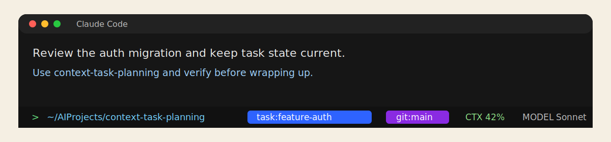

# Claude Code Notes

This page only covers Claude-specific setup and behavior. Use `README.md` for the first success case and `docs/onboarding.md` for the shared workflow.

## Install

Recommended install:

```bash
npx skills add excitedhaha/context-task-planning -g
```

Choose `context-task-planning` and the Claude Code agent when prompted.

Local fallback while developing from a clone:

```bash
sh skill/scripts/install-macos.sh
```

A global install makes the skill available under:

```text
~/.claude/skills/context-task-planning
```

## What Claude adds

After you enable the bundled adapter, Claude Code can surface the shared file-backed task state through:

- a native status line cue such as `task!:<slug>` for explicit writer binding
- `obs:<slug>` when the current session is explicitly bound as observe-only
- `wksp:<slug>` when Claude is only following the shared workspace fallback pointer
- task recovery on session start from the session binding or workspace fallback
- safe compact-time sync before Claude compresses context: writer sessions may repair warning-level snapshot drift and refresh `.derived/context_compact.json`, while observer sessions only refresh the derived compact artifact
- prompt-time reminders when a request looks like likely task drift
- stronger warnings before `Task` launches on mismatched work
- shared `subagent-preflight` context before native `Task` launches, including repo/worktree prefixes for related work and routing or delegate escalation when the fit is wrong
- linked or ambiguous spec context such as auto-detected OpenSpec refs in startup and prompt-time summaries when the current task has a clear external artifact candidate or multiple plausible ones, including a short candidate hint when the runtime refuses to guess
- repo context such as `primary_repo` and `repo_scope` when a task spans multiple repos

## Enable the Claude adapter

1. Install the skill with `npx skills add` or the local script.
2. Merge `skill/claude-hooks/settings.example.json` into one of:

- `~/.claude/settings.json`
- `.claude/settings.local.json`

For first-time testing, `.claude/settings.local.json` is the safest option.

The bundled config includes both hooks and `statusLine`, so copying it is enough to enable the visible task cue.

## What you should notice

After restarting Claude Code, you should see:

- an explicit task cue in the native status line for per-session bindings, or a weaker workspace fallback cue when only `.planning/.active_task` is set
- automatic task-context recovery when the session starts
- on context compaction, Claude refreshes compact recovery context from the shared helper instead of replaying only the shorter session-start snapshot
- a reminder before Claude silently mixes likely-unrelated work into the current task
- the same task still resolving when Claude starts inside a registered repo path or recorded worktree under a parent workspace
- startup and prompt-time summaries can mention one linked spec ref, or a few candidate refs when the runtime refuses to guess
- treat that spec line as scoping help, not as extra setup; only use the manual override path if the work really needs one authoritative ref

Sample illustration:



This is a sample illustration of the expected task cue, not a live screenshot from your machine.

## Task preflight

Claude's `PreToolUse` hook now calls the shared shell-first helper before native `Task` launches:

```bash
sh skill/scripts/subagent-preflight.sh \
  --cwd "$PWD" \
  --host claude \
  --tool-name Task \
  --task-text "Implement the auth migration subagent" \
  --json
```

The helper returns one decision for the launch:

- `payload_only` or `payload_plus_delegate_recommended` - Claude prepends the canonical task and repo/worktree prefix
- `routing_only` - Claude shows routing confirmation only and does not inject the repo/worktree payload
- `delegate_required` - Claude tells you to create or reuse a delegate lane first

If the task resolves a linked OpenSpec context, Claude now surfaces that summary in session-start and prompt-time context, and the injected `Task` preflight prefix includes the same spec context summary and primary linked ref in addition to the repo/worktree scope. When the runtime reports `status=ambiguous`, Claude now receives the candidate refs plus an explicit manual-override hint in both places. Treat that as routing help first; exploratory work can usually continue without resolving candidates up front.

`UserPromptSubmit` stays advisory; the actual native-Task preflight happens in `PreToolUse`.

## If you prefer no hooks

The core skill still works without Claude-specific hooks. You keep the file-backed task workflow, but you lose the native status line and the extra prompt/tool reminders.

Claude's compact hook only does the safe MVP path: it never invents progress from transcript history. For writer sessions it may repair warning-level markdown snapshot drift with `validate-task.sh --fix-warnings`, then it refreshes `.planning/<slug>/.derived/context_compact.json`. For observer sessions it only refreshes the derived compact artifact.

## Manual fallback

Useful commands when you want direct control:

- `sh skill/scripts/init-task.sh "Implement auth flow"`
- `sh skill/scripts/current-task.sh --compact`
- `sh skill/scripts/compact-sync.sh`
- `sh skill/scripts/check-task-drift.sh --prompt "Also investigate the billing webhook regression" --json`
- `sh skill/scripts/subagent-preflight.sh --cwd "$PWD" --host claude --tool-name Task --task-text "Investigate auth entry points" --text`
- `sh skill/scripts/validate-task.sh`
- `sh skill/scripts/set-task-spec-context.sh --task <slug> --ref <spec-ref>`

Use `set-task-spec-context.sh` only when the work really needs one authoritative spec ref. If Claude only shows a few candidate refs during exploration, you can usually keep going without recording a manual override yet.

For the shared progression from first success to multi-session and multi-repo usage, go back to `docs/onboarding.md`. For the deeper architecture behind Claude's task resolution, use `docs/design.md`.
