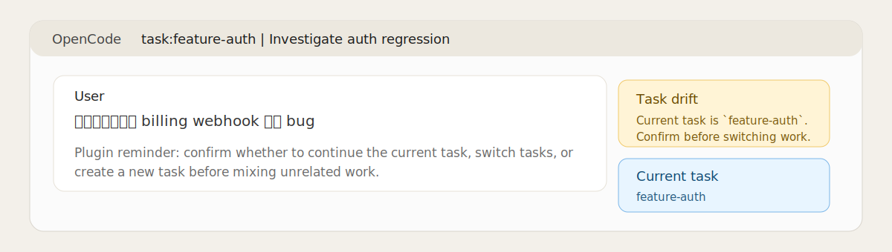

# OpenCode Notes

## Install

Recommended install:

```bash
npx skills add excitedhaha/context-task-planning -g
```

Choose `context-task-planning` and the OpenCode agent when prompted.

Local fallback while developing from a clone:

```bash
sh skill/scripts/install-macos.sh
```

A global install makes the skill available under:

```text
~/.config/opencode/skills/context-task-planning
```

## Usage

This skill is designed so that OpenCode does not need host-specific session parsing in order to recover context.

Most teammates should use it through normal conversation with the agent.

Good asks for OpenCode:

- use `context-task-planning` for the task
- create or resume the task under `.planning/<slug>/`
- recover from `.planning/` after context loss
- create delegate lanes for bounded discovery, review, or verify side quests

Example prompts:

```text
Use context-task-planning for this implementation. Create or resume the task, keep the hot context current, and verify before wrapping up.
```

```text
I lost context. Recover the active task from .planning/ and continue from the recorded next_action.
```

```text
Use context-task-planning and create a delegate lane to scan the repo for relevant entry points. Promote only the distilled findings.
```

If OpenCode does not invoke the skill automatically, mention the skill name explicitly or use the scripts directly.

The canonical state is the task folder itself under `.planning/<slug>/`.

If your OpenCode setup uses a custom skill source list, make sure `~/.config/opencode/skills` is enabled.

## Optional plugin adapter

If you installed from a local clone with:

```bash
sh skill/scripts/install-macos.sh
```

the OpenCode plugin is installed automatically by default.

If you installed the skill through `npx skills add`, OpenCode still needs one extra plugin-install step because it loads skills and local plugins from different directories. Run the bundled helper:

```bash
sh ~/.config/opencode/skills/context-task-planning/scripts/install-opencode-plugin.sh
```

You can also run the helper from a local clone:

```bash
sh skill/scripts/install-opencode-plugin.sh
```

Then restart OpenCode.

If you want the skill symlink but not the runtime plugin from the local installer, use:

```bash
sh skill/scripts/install-macos.sh --skip-opencode-plugin
```

## What users should notice

After the plugin is enabled and OpenCode is restarted, you should see:

- the session title prefixed as `task:<slug> | ...`
- an info toast when the current task is first detected
- a warning toast when a new prompt looks like likely task drift
- a warning toast when tracked work has happened but `.planning/<slug>/` has not been synced for a while
- stronger routing guidance before `Task` runs on mismatched work

Sample illustration:



This is a sample illustration of the expected title/toast fallback, not a live screenshot from your machine.

What the plugin adds:

- injects the current task summary into OpenCode's system prompt each turn
- prefixes the session title as `task:<slug> | ...`, which is the closest current plugin-level path to sidebar visibility
- shows a toast when the current task is first detected or when a likely task switch is detected
- warns when the newest user prompt looks likely unrelated to the current task
- warns when task files look stale after tracked work without a planning sync
- adds a stronger note before `Task` launches if the prompt looks mismatched
- exports `PLAN_TASK` into shell commands so task-aware scripts stay pinned to the active task

This is still a best-effort UI layer. The current OpenCode plugin SDK exposes hooks, session title updates, and TUI toasts, but not a dedicated custom sidebar/statusbar widget API.

It is also still advisory, not a hard transaction layer: the plugin can detect likely stale task state and remind the model to sync `.planning/`, but the actual task file edits are still performed by the model/tools rather than by the plugin itself.

So if you do not see a dedicated sidebar widget, that is expected today; the title prefix is the current visibility fallback.

To reduce global noise, the plugin stays quiet in repositories that do not already use `.planning/`.

## Manual fallback

Useful commands when you want direct control:

- `sh skill/scripts/init-task.sh "Implement auth flow"`
- `sh skill/scripts/validate-task.sh`
- `sh skill/scripts/prepare-delegate.sh --kind discovery "Map auth entry points"`
